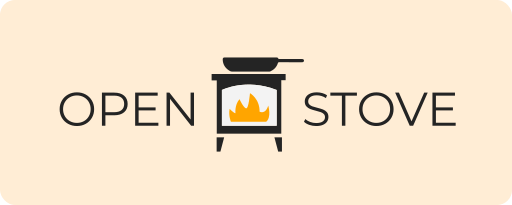

  

  

&nbsp;

> Welcome to **OpenStove – a curated collection of community-crafted recipes**. OpenStove is a digital gathering space where culinary enthusiasts come together to discover, share, and contribute recipes. No ads, no fees – just a love for food and community.

## What is OpenStove?

OpenStove is built on the belief that the best cooking experiences come from shared knowledge. We provide a platform free from distracting ads where you have direct access to a diverse collection of dishes curated and cherished by food lovers from all over the world.

### Features

- A diverse and growing recipe database.
- A user-friendly platform free from distracting ads.
- Community-driven curation and contribution.

## Tailored for Food Lovers

Discover new recipes from our ever-growing database, curated by food lovers worldwide. OpenStove is more than just a recipe site – it's a collective archive of culinary delights, where each contribution enriches our cooking experience.

## Contribute a Recipe

We encourage everyone to share their recipes and tips!

1. **Easiest:** use the [online form](https://openstove.org/contribute) – no Git required.
2. Or follow [CONTRIBUTING.md](https://github.com/mearashadowfax/OpenStove/blob/main/CONTRIBUTING.md) and open a pull request with a Markdown recipe.

Recipe photos are hosted on a private CDN (not in this public repository) for licensing reasons. See `.env.example` and `scripts/upload-recipe-images.mjs` for maintainer image setup.

## Deploy notes (maintainers)

- Point Vercel at this public repo (retire any private fork as the deploy source).
- Set `PUBLIC_IMAGE_BASE_URL` after uploading AVIFs with the Blob upload script.
- Set `GITHUB_TOKEN` + `GITHUB_REPO` (and optional Turnstile keys) for the contribute form.
- Optional Keystatic admin at `/keystatic` (local in dev; GitHub mode in production with Keystatic env vars).

## License

OpenStove **code and recipe text** are licensed under the [Creative Commons Attribution-NonCommercial-ShareAlike 4.0 International License](http://creativecommons.org/licenses/by-nc-sa/4.0/).

- **Attribute** – Provide proper credit, link to the license, and note any changes.
- **NonCommercial** – Material cannot be used for commercial purposes.
- **ShareAlike** – If you remix, transform, or build upon the material, distribute your contributions under the same license as the original.

Recipe **photographs** are not included in this repository and are licensed separately.

[View Full License](https://github.com/mearashadowfax/OpenStove/blob/main/LICENSE)
